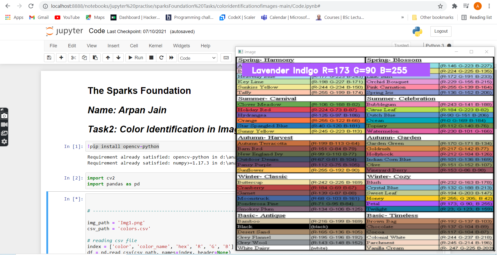

# Color-Identification-in-Images

<h2>THIS IS THE SMALL BEGINNERS FRIENDLY PROJECT WHICH HELP US TO IDENTIFY THE CORRECT RGB VALUE ON A DOUBLE CLICK ON PARTICULAR PLACE IN IMAGE.</h2>
<b><b>

  <b> <b> <b>

